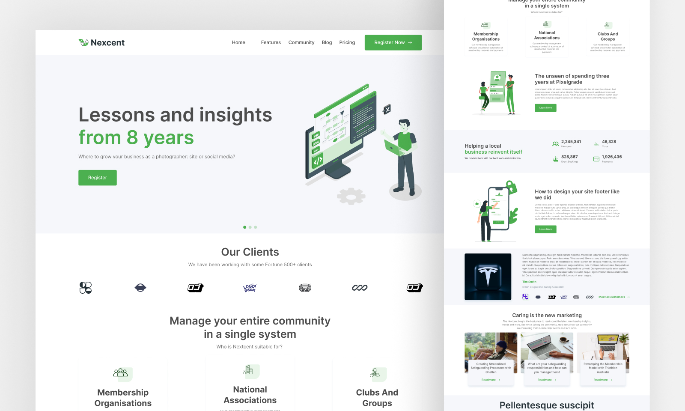

> "Writing this README for the rare few who stumble upon it. If you're reading this, I appreciate your curiosity."

# Nexcent Landing Page

## The "Welcome Back" Project

After taking a break from web development, I’ve built this project to get back into the flow.

**Nexcent** is a clean, **fully responsive** landing page developed using **Vite**, **React**, **TypeScript**, **MUI**, and **Tailwind CSS**.

## Key Focus

While the design is kept simple, the core focus of this project was **clean code architecture** and achieving **pixel-perfect responsiveness** across all screen sizes.

## This design is taken from [Minimal Landing Page Design](https://www.figma.com/design/A3tH8i99AbMKwTv06sp6e0/Minimal-Landing-Page-Design-%7C-Website-Home-Page-Design-%7C-Agency-Website-UI-Design--Community-?node-id=211-1053)
